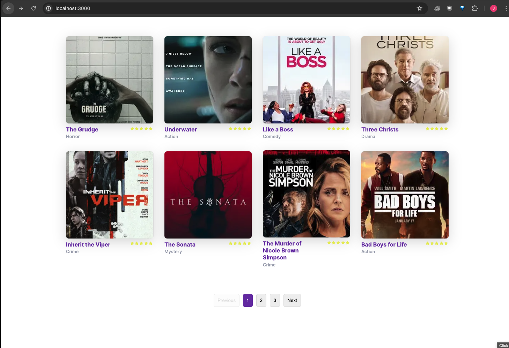

# Movie List

 

## Setup Frontend Project:

1. clone project `https://github.com/john2796/global-tekmed.git`
2. cd project `cd global-tekmed`
3. cd Frontend folder `cd tekmed-movie-fe/`
4. install dependencies `npm install`
5. start project `npm run dev`
6. click or open: `http://localhost:3000`

## Setup Backend Project:

1. Create a Virtual Environment If you haven't created a virtual environment
   yet, you can create one using the following command:

```bash
python3 -m venv myenv
```

2. Activate the Virtual Environment To activate the virtual environment, you use
   the source command followed by the path to the activation script:

```bash
# On macOS/Linux:
source myenv/bin/activate
# On Windows:
myenv\Scripts\activate

```

3. Install packages:

   ```bash
   pip install -r requirements.txt
   ```

4. Create and Apply Migrations

   ```bash
   python manage.py makemigrations
   python manage.py migrate
   ```

5. Load the fixture data:

   ```bash
   python manage.py load_movies
   ```

6. Run the Development Server
   ```bash
   python manage.py runserver
   ```
